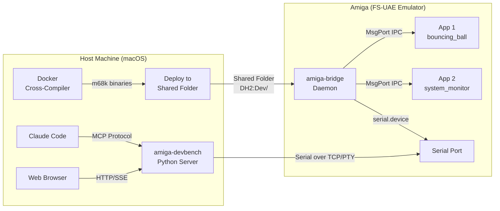
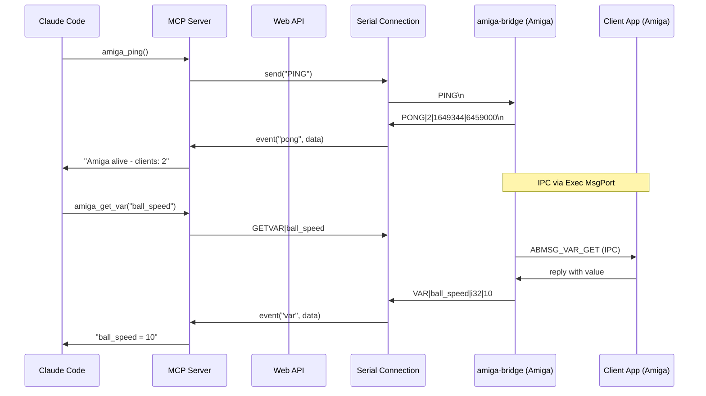
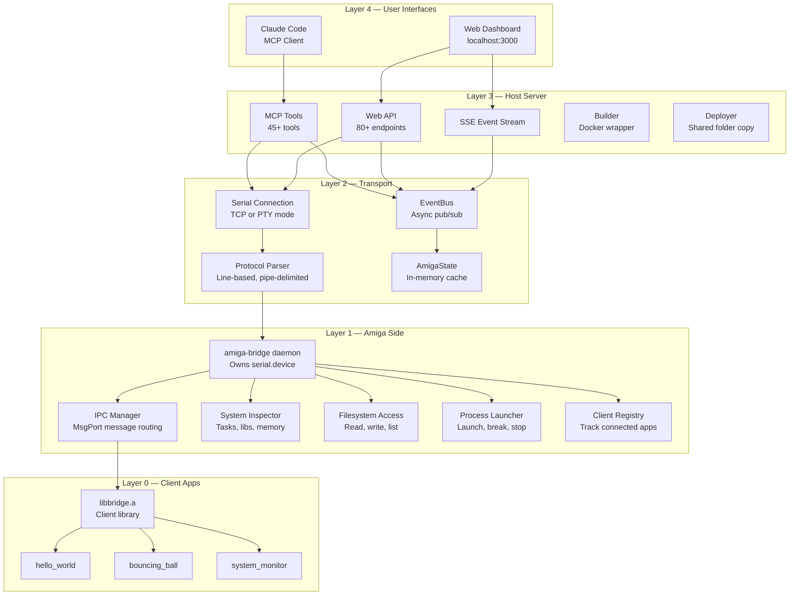
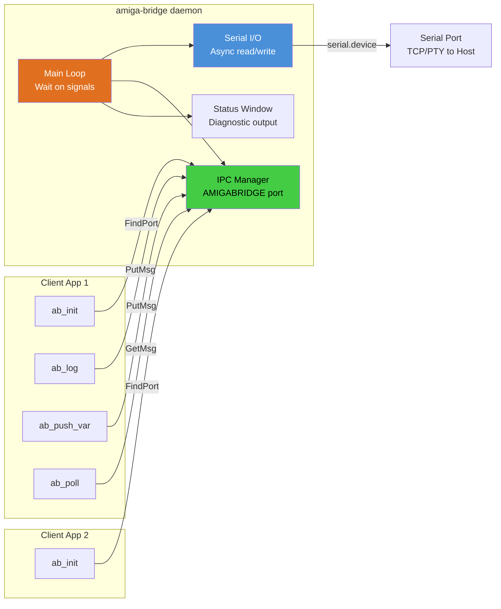
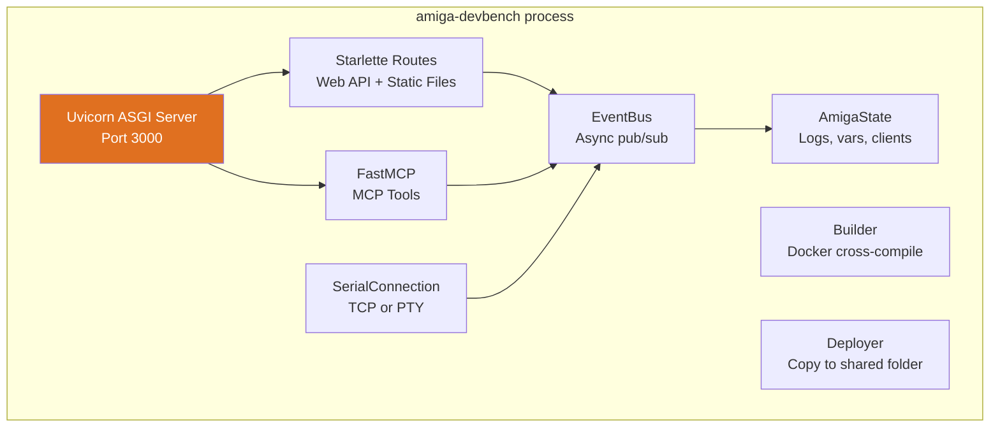
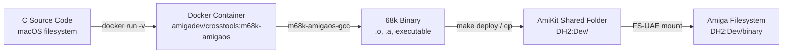
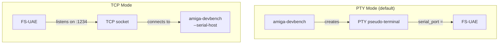

# Amiga DevBench — Architecture & Reference Guide

A cross-development environment for Commodore Amiga (68k) that connects a modern
host machine to an emulated (or real) Amiga via serial, providing live debugging,
memory inspection, variable editing, remote execution, and full MCP integration
with Claude Code.


---

## One-line install

Brew-style installer — fetches the source, installs the Python host server, pulls the m68k Docker cross-compiler, builds the bridge daemon + examples, and launches the web UI on http://localhost:3000. Re-running pulls the latest commit and rebuilds in place.

**macOS / Linux:**

```sh
curl -fsSL https://raw.githubusercontent.com/geekychris/amiga_mcp/main/scripts/install.sh | bash
```

**Windows (PowerShell):**

```powershell
iwr -useb https://raw.githubusercontent.com/geekychris/amiga_mcp/main/scripts/install.ps1 | iex
```

The installer requires `git`, `python>=3.10`, and Docker. On mac/Linux you can opt into auto-install of missing CLI tools with `AMIGA_MCP_AUTO_INSTALL=1`. Docker Desktop on macOS/Windows needs a GUI install regardless.

**What it does NOT install:** FS-UAE itself (you need a Kickstart ROM — see [FS-UAE Emulator Setup](#fs-uae-emulator-setup)). The optional [patched fs-uae fork](https://github.com/geekychris/fsuae_remote_patch) with the HTTP debugger is opt-in via `AMIGA_MCP_BUILD_PATCHED=1` (Linux + macOS). DevBench works fine with stock fs-uae either way; the patched build unlocks the **FS-UAE** tab in the Web UI and the `amiga_fsuae_*` MCP tools.

**Knobs** (env vars before invoking):

| Variable | Default | Meaning |
|---|---|---|
| `AMIGA_MCP_SRC` | `$HOME/.amiga-devbench/src` | Where to clone the repo |
| `AMIGA_MCP_REF` | `main` | Git ref to check out |
| `AMIGA_MCP_REPO` | `https://github.com/geekychris/amiga_mcp.git` | Remote |
| `AMIGA_MCP_BUILD` | `1` | Build examples via Docker (`0` to skip) |
| `AMIGA_MCP_START` | `1` | Launch web UI in background (`0` to install only) |
| `AMIGA_MCP_OPEN` | `1` | Open browser when ready (`0` to suppress) |
| `AMIGA_MCP_AUTO_INSTALL` | `0` | (mac/Linux) `1` to brew/apt/dnf install missing deps |
| `AMIGA_MCP_BUILD_PATCHED` | `0` | (mac/Linux) `1` to clone+build the patched fs-uae fork into `~/.amiga-devbench/fs-uae`. Combine with `AMIGA_MCP_AUTO_INSTALL=1` to also install the ~10 system libs it needs. Takes ~10 min. |

### How devbench picks the fs-uae binary

`[emulator] binary` in `devbench.toml` accepts the literal `"auto"` (default). When `auto`, devbench searches in order:

1. `$AMIGA_MCP_FSUAE_BIN` env var
2. `~/.amiga-devbench/fs-uae` (installed by `AMIGA_MCP_BUILD_PATCHED=1`)
3. `/tmp/fsuae-src/fs-uae` (default output path of the patched fork's `build.sh`)
4. `~/code/fsuae_remote_patch/fs-uae` (common dev checkout)
5. `fs-uae` on `PATH` (stock build from Homebrew / apt / etc.)

It prefers the patched build when found (probed by scanning the binary for the `fs-uae-rpc` service string). Set `binary` to an explicit path to pin a specific build. Check `/api/emulator/status` (`patched: true|false`) or the devbench startup log to confirm which one was selected.

The web UI runs in the background under `$HOME/.amiga-devbench/run/devbench.pid` with logs in `$HOME/.amiga-devbench/logs/`. Stop with `kill $(cat ~/.amiga-devbench/run/devbench.pid)` (or `Stop-Process` on Windows).

---

## Table of Contents

1. [Overview](#overview)
2. [System Architecture](#system-architecture)
3. [Component Deep Dives](#component-deep-dives)
4. [Build Toolchain](#build-toolchain)
5. [FS-UAE Emulator Setup](#fs-uae-emulator-setup)
6. [Bridge Protocol](#bridge-protocol)
7. [Client Library API](#client-library-api)
8. [Programming Examples](#programming-examples)
9. [MCP Tools Reference](#mcp-tools-reference)
10. [Developing Amiga Software with Claude Code](#developing-amiga-software-with-claude-code)
11. [Web UI Reference](#web-ui-reference)
    - [Tab Organization](#tab-organization)
    - [Debugger Tab](#debugger-tab)
12. [Scripts & Utilities](#scripts--utilities)
13. [Future Improvements](#future-improvements)

---

## Overview

Traditional Amiga development is painful: no source-level debugger on the target,
no network stack on stock machines, and crashes take down the entire OS. This
project solves that by bridging the gap between a modern development host and the
Amiga over a serial link.

**What it enables:**

- Write C code on macOS, cross-compile via Docker, deploy to emulator in one command
- Live-inspect memory, registers, tasks, libraries, and volumes on the running Amiga
- Register variables in your Amiga app and read/write them from the host in real-time
- Define "hooks" — functions the host can call into your running app remotely
- Launch, stop, and break Amiga programs from the host
- Execute arbitrary AmigaDOS scripts on the Amiga from the host
- Read and write files on the Amiga filesystem
- **Source-level debugger** — set breakpoints, step into/over, inspect registers and call stack
- Monitor everything through a web dashboard or Claude Code MCP tools
- Manage files, assigns, processes, and protection bits without touching the Amiga
- Verify deployments with CRC32 checksums, tail log files in real-time
- Full process lifecycle: launch, track, signal, and stop async processes

Before we go any further.  The purpose of this tool is to make the amazing amiga community productive with AI.  Here are some screenshots of games I clobbered together in an afternoon.  They are included as examples and as of publishing are terrible.  Go ahead make them better:

Frank the frog


Invaded


Moon kindalookaround


PacBro




---

## System Architecture

### High-Level Data Flow



### Component Layers



### Amiga-Side IPC Architecture



The daemon owns the serial port exclusively. Client apps never touch serial —
they communicate via AmigaOS MsgPort IPC (`FindPort("AMIGABRIDGE")` + `PutMsg/GetMsg`).

---

## Component Deep Dives

### amiga-bridge (Amiga Daemon)

The heart of the Amiga side. A single process that:

1. **Opens serial.device** with async I/O (SendIO/CheckIO) for non-blocking reads
2. **Creates MsgPort "AMIGABRIDGE"** for client app registration
3. **Runs a Wait() loop** on serial + IPC + window signals
4. **Routes messages** between serial (host) and IPC (client apps)
5. **Provides system inspection** without requiring a client app (task list, memory, etc.)

| Source File | Responsibility |
|---|---|
| `main.c` | Event loop, status window, signal handling |
| `serial_io.c` | serial.device open/close, async read/write |
| `ipc_manager.c` | MsgPort creation, message routing |
| `client_registry.c` | Track active clients by name/ID |
| `protocol_handler.c` | Parse host commands, format responses (~1400 lines) |
| `system_inspector.c` | Task/lib/device/volume listing, memory inspection |
| `fs_access.c` | Directory listing, file read/write, rename, copy, protect, comment, checksum (CRC32), append |
| `process_launcher.c` | Launch processes (async), path validation, CTRL-C, process tracking (up to 16), signal delivery |

**Key design decisions:**

- All large buffers are `static` to avoid 4KB default stack overflow
- Uses `Forbid()/Permit()` for task list iteration (minimal critical sections)
- Volatile byte-by-byte reads for memory inspection (CopyMem returns zeros in FS-UAE for some regions)
- Process launcher validates path with `Lock()` before launch, suppresses requesters with `pr_WindowPtr = -1`
- Custom chip registers ($DFF000) blocked from reads (byte access corrupts word-only registers)

### amiga-devbench (Host Server)

A single Python application that combines:



#### UI

See [Web UI Reference](#web-ui-reference) for detailed documentation with screenshots of all 8 tabs.

| Module | Purpose |
|---|---|
| `server.py` | Starlette app, all HTTP/SSE endpoints, PID file singleton |
| `mcp_tools.py` | 45+ MCP tool definitions using FastMCP |
| `protocol.py` | `parse_message()` and `format_command()` — protocol codec |
| `serial_conn.py` | `SerialConnection` class — PTY creation, TCP connect, auto-reconnect |
| `state.py` | `AmigaState` (log buffer, var cache) + `EventBus` (async queue-based pub/sub) |
| `builder.py` | `Builder` class — wraps `docker run` for cross-compilation |
| `deployer.py` | `Deployer` class — copies binaries to AmiKit shared folder |
| `simulator.py` | Fake Amiga that speaks the bridge protocol (for testing without emulator) |
| `__main__.py` | CLI entry point with argparse |

**Connection modes:**

- **PTY mode** (default): Creates a pseudo-terminal at `/tmp/amiga-serial`, FS-UAE opens it as its serial port
- **TCP mode** (`--serial-host`): Connects to FS-UAE's TCP serial port (e.g., `tcp://0.0.0.0:1234`)

### libbridge.a (Client Library)

Static library that Amiga apps link against. Provides a simple API for:

- Registering with the daemon
- Logging (printf-style, 4 severity levels)
- Registering variables for remote inspection/modification
- Registering hooks (functions the host can call)
- Registering memory regions (named areas the host can read)
- Polling for incoming commands
- Sending heartbeats

**Resource limits per client:** 32 variables, 16 hooks, 8 memory regions

**Message pool:** 4 pre-allocated `BridgeMsg` structures (no malloc per call)

---

## Build Toolchain

### Cross-Compilation via Docker



**Docker image:** `amigadev/crosstools:m68k-amigaos`
- Debian-based with `m68k-amigaos-gcc` cross-compiler
- Includes AmigaOS headers and amiga.lib
- Mounted project root as `/work`

**Compiler flags:**

| Flag | Purpose |
|---|---|
| `-noixemul` | No Unix emulation — pure AmigaOS (mandatory) |
| `-m68020` | Target 68020 CPU (A1200 default) |
| `-O0` | No optimization (easier debugging) |
| `-Wall` | All warnings |
| `-Iinclude` | Bridge header path |
| `-lbridge` | Link client library |
| `-lamiga` | Link amiga.lib |

**Build commands:**

```bash
make all          # Build everything (lib + bridge + examples)
make bridge       # Build daemon + libbridge.a
make examples     # Build hello_world, bouncing_ball, system_monitor
make clean        # Clean all artifacts
```

### Deploy Path

Host path:
```
/Applications/AmiKit.app/Contents/SharedSupport/prefix/drive_c/AmiKit/Dropbox/Dev/
```

Amiga path:
```
DH2:Dev/
```

Binaries are copied to the host path and immediately visible on the Amiga via
the FS-UAE shared folder mount.

---

## FS-UAE Emulator Setup

### Configuration File

**Location:** `~/Documents/FS-UAE/Configurations/AmiKit-Debug.fs-uae`

```ini
[fs-uae]
# Kickstart ROM
kickstart_file = ~/Documents/FS-UAE/Kickstarts/kick.rom

# Hardware: A1200 with 68020+FPU, 2MB chip, 8MB fast
amiga_model = A1200
cpu = 68020
fpu = 68882
chip_memory = 2048
fast_memory = 8192

# Hard drives
hard_drive_0 = ~/Documents/FS-UAE/Hard Drives/System     # DH0: (boot)
hard_drive_1 = .../AmiKit/RabbitHole/InstalledOS          # DH1: (OS extras)
hard_drive_2 = .../AmiKit/Dropbox                         # DH2: (Dev binaries)

# Serial: TCP mode (devbench connects as client)
serial_port = tcp://0.0.0.0:1234
serial_on_demand = false

# Mouse: don't capture
mouse_integration = 1
automatic_input_grab = 0
initial_input_grab = 0
cursor_integration = 1

# Networking
bsdsocket_library = 1
```

### Startup Sequence

**Location:** `~/Documents/FS-UAE/Hard Drives/System/S/Startup-Sequence`

Key additions for the development environment:

```
; Suppress "Please insert Work" requester
Assign >NIL: Work: RAM:

; Auto-start bridge daemon
If EXISTS DH2:Dev/amiga-bridge
  Run >NIL: DH2:Dev/amiga-bridge
EndIf
```

### Connection Modes



**PTY mode:** devbench must start before FS-UAE (creates the PTY file)
**TCP mode:** FS-UAE must start before devbench (listens on port)

---

## Bridge Protocol

Line-based text protocol over serial. Each message is `\n`-terminated,
fields are pipe-delimited (`|`), maximum 1024 characters per line.

### Amiga → Host Messages

#### Logging & Status
| Message | Format | Description |
|---|---|---|
| LOG | `LOG\|level\|tick\|message` | App log (level: D/I/W/E) |
| CLOG | `CLOG\|client\|level\|tick\|message` | Client-attributed log |
| HB | `HB\|tick\|freeChip\|freeFast` | Heartbeat |
| PONG | `PONG\|clientCount\|freeChip\|freeFast` | Ping response |
| READY | `READY\|version` | Daemon startup |

#### Variables
| Message | Format | Description |
|---|---|---|
| VAR | `VAR\|name\|type\|value` | Variable value (type: i32/u32/str/f32/ptr) |
| CVAR | `CVAR\|client\|name\|type\|value` | Client-attributed variable |

#### Memory
| Message | Format | Description |
|---|---|---|
| MEM | `MEM\|addr_hex\|size\|hex_data` | Memory dump response |

#### System Info
| Message | Format | Description |
|---|---|---|
| CLIENTS | `CLIENTS\|count\|name1,name2,...` | Connected clients |
| TASKS | `TASKS\|count\|name(pri,state,type),...` | Task list |
| LIBS | `LIBS\|count\|name(v.r),...` | Library list |
| DEVICES | `DEVICES\|count\|name(v.r),...` | Device list |
| VOLUMES | `VOLUMES\|count\|name1,name2,...` | Volume list |

#### Files
| Message | Format | Description |
|---|---|---|
| DIR | `DIR\|path\|count\|name(size,type),...` | Directory listing |
| FILE | `FILE\|path\|size\|offset\|hex_data` | File content |
| FILEINFO | `FILEINFO\|path\|size\|date\|protbits` | File metadata |

#### Process & Commands
| Message | Format | Description |
|---|---|---|
| PROC | `PROC\|id\|status\|output` | Process completion |
| CMD | `CMD\|id\|status\|response` | Command response |

#### Client Introspection
| Message | Format | Description |
|---|---|---|
| HOOKS | `HOOKS\|client\|count\|name:desc,...` | Hook list |
| MEMREGS | `MEMREGS\|client\|count\|name:addr:size:desc,...` | Memory regions |
| CINFO | `CINFO\|name\|id\|msgs\|vars:...\|hooks:...\|memregs:...` | Full client info |

#### Hardware & Inspection
| Message | Format | Description |
|---|---|---|
| MEMMAP | `MEMMAP\|count\|name:attr:lower:upper:free:largest,...` | Memory region map |
| STACKINFO | `STACKINFO\|task\|spLower\|spUpper\|spReg\|size\|used\|free` | Task stack info |
| CHIPREGS | `CHIPREGS\|count\|name:addr:value\|...` | Custom chip register values |
| REGS | `REGS\|D0=val\|D1=val\|...\|SP=val\|SR=val` | CPU register snapshot |
| SEARCH | `SEARCH\|count\|addr1,addr2,...` | Memory search results |

#### Acknowledgements
| Message | Format | Description |
|---|---|---|
| OK | `OK\|context\|detail` | Success |
| ERR | `ERR\|context\|detail` | Error |

### Host → Amiga Commands

#### Connection
| Command | Format | Description |
|---|---|---|
| PING | `PING` | Request status |
| SHUTDOWN | `SHUTDOWN` | Terminate daemon |

#### Variables
| Command | Format | Description |
|---|---|---|
| GETVAR | `GETVAR\|name` | Get variable value |
| SETVAR | `SETVAR\|name\|value` | Set variable value |

#### Memory
| Command | Format | Description |
|---|---|---|
| INSPECT | `INSPECT\|addr_hex\|size` | Request memory dump |
| WRITEMEM | `WRITEMEM\|addr_hex\|hex_data` | Write to memory |

#### System Queries
| Command | Format | Description |
|---|---|---|
| LISTCLIENTS | `LISTCLIENTS` | List clients |
| LISTTASKS | `LISTTASKS` | List tasks |
| LISTLIBS | `LISTLIBS` | List libraries |
| LISTDEVS | `LISTDEVS` | List devices |
| LISTVOLUMES | `LISTVOLUMES` | List volumes |

#### Filesystem
| Command | Format | Description |
|---|---|---|
| LISTDIR | `LISTDIR\|path` | List directory |
| READFILE | `READFILE\|path\|offset\|size` | Read file |
| WRITEFILE | `WRITEFILE\|path\|offset\|hex_data` | Write file |
| FILEINFO | `FILEINFO\|path` | Get file info |
| DELETEFILE | `DELETEFILE\|path` | Delete file |
| MAKEDIR | `MAKEDIR\|path` | Create directory |

#### Process Control
| Command | Format | Description |
|---|---|---|
| LAUNCH | `LAUNCH\|id\|command` | Run and wait |
| RUN | `RUN\|id\|command` | Run async |
| DOSCOMMAND | `DOSCOMMAND\|id\|command` | Run AmigaDOS command |
| BREAK | `BREAK\|task_name` | Send CTRL-C |
| SCRIPT | `SCRIPT\|id\|script_text` | Execute script (newlines → `;`) |
| STOP | `STOP\|client_name` | Stop client (CTRL-C + IPC shutdown) |

#### Hardware & Inspection
| Command | Format | Description |
|---|---|---|
| MEMMAP | `MEMMAP` | Request memory region map |
| STACKINFO | `STACKINFO\|taskname` | Request stack info for a task |
| CHIPREGS | `CHIPREGS` | Read safe custom chip registers |
| READREGS | `READREGS` | Capture CPU registers |
| SEARCH | `SEARCH\|addr_hex\|size\|pattern_hex` | Search memory for byte pattern |

#### Hooks & Memory Regions
| Command | Format | Description |
|---|---|---|
| LISTHOOKS | `LISTHOOKS\|client` | List hooks |
| CALLHOOK | `CALLHOOK\|id\|client\|hook\|args` | Call hook |
| LISTMEMREGS | `LISTMEMREGS\|client` | List memory regions |
| READMEMREG | `READMEMREG\|client\|region` | Read region |
| CLIENTINFO | `CLIENTINFO\|client` | Get client details |

#### Capabilities & Process Management
| Command | Format | Description |
|---|---|---|
| CAPABILITIES | `CAPABILITIES` | Query daemon version, protocol level, supported commands |
| PROCLIST | `PROCLIST` | List tracked async processes |
| PROCSTAT | `PROCSTAT\|id` | Get status of a tracked process |
| SIGNAL | `SIGNAL\|id\|sigType` | Send signal to tracked process (0=CTRL-C, 1=CTRL-D, 2=CTRL-E, 3=CTRL-F) |

#### Extended Filesystem Operations
| Command | Format | Description |
|---|---|---|
| RENAME | `RENAME\|oldPath\|newPath` | Rename or move a file |
| COPY | `COPY\|src\|dst` | Copy a file server-side (no host round-trip) |
| APPEND | `APPEND\|path\|hexData` | Append hex-encoded data to a file |
| CHECKSUM | `CHECKSUM\|path` | Compute CRC32 checksum and file size |
| PROTECT | `PROTECT\|path` | Get protection bits |
| PROTECT | `PROTECT\|path\|bits` | Set protection bits (hex) |
| SETCOMMENT | `SETCOMMENT\|path\|comment` | Set file comment (filenote) |

#### Assign Management
| Command | Format | Description |
|---|---|---|
| ASSIGNS | `ASSIGNS` | List all DOS assigns |
| ASSIGN | `ASSIGN\|name\|path` | Create/replace an assign |
| ASSIGN | `ASSIGN\|name\|path\|ADD` | Add path to multi-assign |
| ASSIGN | `ASSIGN\|name\|\|REMOVE` | Remove an assign |

#### File Tail (Live Streaming)
| Command | Format | Description |
|---|---|---|
| TAIL | `TAIL\|path` | Start tailing a file for new data |
| STOPTAIL | `STOPTAIL` | Stop tailing |

### Amiga → Host (New Messages)

| Message | Format | Description |
|---|---|---|
| CAPABILITIES | `CAPABILITIES\|version\|protocolLevel\|maxLine\|cmd1,cmd2,...` | Daemon capabilities |
| PROCLIST | `PROCLIST\|count\|id:cmd:status,...` | Tracked process list |
| PROCSTAT | `PROCSTAT\|id\|command\|status` | Single process status |
| TAILDATA | `TAILDATA\|path\|hexData` | New data appended to tailed file |
| CHECKSUM | `CHECKSUM\|path\|crc32\|size` | File CRC32 and size |
| ASSIGNS | `ASSIGNS\|count\|name:path:type,...` | Assign list (type: A=assign, L=late, N=nonbinding) |
| PROTECT | `PROTECT\|path\|bits` | File protection bits (hex) |

---

## Client Library API

### Header: `bridge_client.h`

```c
#include "bridge_client.h"
```

### Variable Types

```c
#define AB_TYPE_I32  0   /* signed 32-bit integer */
#define AB_TYPE_U32  1   /* unsigned 32-bit integer */
#define AB_TYPE_STR  2   /* null-terminated string */
#define AB_TYPE_F32  3   /* 32-bit float */
#define AB_TYPE_PTR  4   /* pointer (displayed as hex) */
```

### Functions

#### Initialization
```c
int  ab_init(const char *appName);   /* Returns 0 on success, -1 on failure */
void ab_cleanup(void);               /* Unregister from daemon */
BOOL ab_is_connected(void);          /* Check daemon connection */
```

#### Logging
```c
void ab_log(int level, const char *fmt, ...);   /* Printf-style */

/* Convenience macros */
AB_D(fmt, ...)   /* DEBUG */
AB_I(fmt, ...)   /* INFO */
AB_W(fmt, ...)   /* WARN */
AB_E(fmt, ...)   /* ERROR */
```

#### Variables
```c
void ab_register_var(const char *name, int type, void *ptr);
void ab_unregister_var(const char *name);
void ab_push_var(const char *name);   /* Send current value to host */
```

#### Heartbeat & Memory
```c
void ab_heartbeat(void);                      /* Send status pulse */
void ab_send_mem(APTR addr, ULONG size);      /* Dump memory to host */
```

#### Command Handling
```c
typedef void (*ab_cmd_handler_t)(ULONG id, const char *data);
void ab_set_cmd_handler(ab_cmd_handler_t handler);
void ab_poll(void);                            /* Check for commands (non-blocking) */
void ab_cmd_respond(ULONG id, const char *status, const char *data);
```

#### Hooks (Host-Callable Functions)
```c
typedef int (*ab_hook_fn_t)(const char *args, char *resultBuf, int bufSize);
void ab_register_hook(const char *name, const char *description, ab_hook_fn_t fn);
void ab_unregister_hook(const char *name);
```

#### Memory Regions
```c
void ab_register_memregion(const char *name, APTR addr, ULONG size,
                           const char *description);
void ab_unregister_memregion(const char *name);
```

---

## Programming Examples

### Minimal App — Hello World

```c
#include <proto/exec.h>
#include <proto/dos.h>
#include "bridge_client.h"

int main(void)
{
    if (ab_init("hello") != 0) {
        printf("Bridge not running\n");
        return 1;
    }

    AB_I("Hello from Amiga!");
    Delay(50);
    ab_cleanup();
    return 0;
}
```

**Build:** Link with `-lbridge -lamiga`

### Variables — Remote Monitoring

```c
#include <proto/exec.h>
#include <proto/dos.h>
#include "bridge_client.h"

static LONG score = 0;
static LONG lives = 3;
static char player_name[32] = "Player1";

int main(void)
{
    ab_init("game");

    /* Register variables — host can read and write these */
    ab_register_var("score", AB_TYPE_I32, &score);
    ab_register_var("lives", AB_TYPE_I32, &lives);
    ab_register_var("player_name", AB_TYPE_STR, player_name);

    while (lives > 0) {
        score += 10;

        /* Push updated values to host every 50 frames */
        if (score % 500 == 0) {
            ab_push_var("score");
            ab_push_var("lives");
            ab_heartbeat();
        }

        /* Check for host commands (GETVAR, SETVAR, etc.) */
        ab_poll();

        Delay(1);
    }

    AB_I("Game over! Score: %ld", (long)score);
    ab_cleanup();
    return 0;
}
```

The host can now:
- Read `score` with `GETVAR|score`
- Set `lives` with `SETVAR|lives|99`
- See values in the web dashboard or via MCP tools

### Hooks — Remote Function Calls

```c
#include <proto/exec.h>
#include <proto/dos.h>
#include "bridge_client.h"

static LONG difficulty = 1;

/* Hook: called by the host, runs on the Amiga */
static int hook_set_difficulty(const char *args, char *result, int bufSize)
{
    if (args && args[0]) {
        difficulty = strtol(args, NULL, 10);
        sprintf(result, "Difficulty set to %ld", (long)difficulty);
    } else {
        sprintf(result, "Current difficulty: %ld", (long)difficulty);
    }
    return 0;  /* 0 = success */
}

static int hook_reset(const char *args, char *result, int bufSize)
{
    difficulty = 1;
    strncpy(result, "Reset complete", bufSize - 1);
    return 0;
}

int main(void)
{
    BOOL running = TRUE;
    ab_init("game");

    ab_register_var("difficulty", AB_TYPE_I32, &difficulty);

    /* Register hooks — host can call these by name */
    ab_register_hook("set_difficulty",
                     "Set game difficulty (1-10)",
                     hook_set_difficulty);
    ab_register_hook("reset",
                     "Reset all settings",
                     hook_reset);

    while (running) {
        /* IMPORTANT: Do NOT call ab_log inside hooks!
         * The daemon is waiting for the hook reply. */
        ab_poll();

        if (SetSignal(0L, SIGBREAKF_CTRL_C) & SIGBREAKF_CTRL_C)
            running = FALSE;

        Delay(5);
    }

    ab_cleanup();
    return 0;
}
```

From Claude Code: `amiga_call_hook("game", "set_difficulty", "5")`
From Web UI: Hooks panel → Call

### Memory Regions — Named Memory Areas

```c
#include <proto/exec.h>
#include "bridge_client.h"

struct GameState {
    LONG x, y;
    LONG vx, vy;
    LONG score;
    LONG level;
};

static struct GameState state = {100, 50, 2, 1, 0, 1};

int main(void)
{
    ab_init("game");

    /* Register a named memory region the host can inspect */
    ab_register_memregion("gamestate",
                          &state, sizeof(state),
                          "Player position, velocity, score, level");

    /* ... game loop ... */

    ab_cleanup();
    return 0;
}
```

The host can read the raw bytes of `gamestate` at any time for low-level inspection.

### Full Example — Bouncing Ball (excerpts)

```c
/* Register settable variables */
static LONG ball_speed = 1;
static LONG ball_color = 3;

ab_register_var("ball_speed", AB_TYPE_I32, &ball_speed);
ab_register_var("ball_color", AB_TYPE_I32, &ball_color);

/* Main loop uses the variables */
while (running) {
    draw_ball(rp, ball_x, ball_y, (UBYTE)ball_color);
    ball_x += dx;
    ball_y += dy;

    /* Push updates periodically */
    if (frame_count % 60 == 0) {
        ab_push_var("ball_speed");
        ab_push_var("ball_color");
        ab_heartbeat();
    }

    ab_poll();  /* Always poll! */
    Delay(ball_speed < 1 ? 1 : ball_speed);
}
```

Change the ball color from the web UI by editing `ball_color`, or from
Claude Code with `amiga_set_var("ball_color", "1")`.

### AmigaOS C Gotchas

| Gotcha | Fix |
|---|---|
| `sprintf` returns `char*`, not `int` | Use `strlen()` after if you need length |
| `%d` reads 16-bit WORD | Always use `%ld` with `(long)` cast |
| `%x` reads 16-bit WORD | Always use `%lx` with `(unsigned long)` cast |
| `%c` misaligns stack | Use `%s` with a 2-char string buffer |
| Default stack is 4KB | Make large buffers `static` |
| No memory protection | Buffer overflow crashes the entire OS |
| `Forbid()/Permit()` imbalance | Freezes system permanently |
| `WaitPort()` blocks forever | Use polling with timeout instead |

---

## Two debuggers: when to use which

DevBench exposes two independent debuggers, each with its own UI tab, MCP tool family, and HTTP API. They're complementary — pick the one that matches what you're trying to inspect.

### Bridge debugger — "what is my app doing?"

**UI tab:** `Debugger` &nbsp;&nbsp; **MCP prefix:** `amiga_debugger_*` &nbsp;&nbsp; **API prefix:** `/api/debugger/*`

Talks to the `amiga-bridge` daemon running in Amiga RAM, over the serial link (TCP or PTY). Source-level: knows about your symbols, lines, locals, call stack. Drives one of your processes via `Launch & Attach`.

**Best for:**
- Stepping through your own C functions line by line
- Reading local variables and walking the call stack of your task
- Breaking at function names or source lines
- Watching variables you registered with `ab_register_var()`

**Limitations:**
- Requires the bridge daemon to be running and your app to be attached
- Bridge dies if the OS hangs / crashes / hasn't booted yet
- Can't see inside Kickstart ROM or other tasks
- No hardware-level watchpoints (limited to bridge-instrumented stops)

### FS-UAE native debugger — "what is the emulator doing?"

**UI tab:** `FS-UAE` &nbsp;&nbsp; **MCP prefix:** `amiga_fsuae_*` &nbsp;&nbsp; **API prefix:** `/api/fsuae/*`

Talks to the patched [fs-uae build](https://github.com/geekychris/fsuae_remote_patch) over HTTP. Emulator-level: pauses the 68k CPU itself, sees every memory access, every cycle. No bridge daemon needed.

**Best for:**
- "Who keeps clobbering `$DFF180`?" — hardware-style watchpoints with R/W/I and mustchange
- Inspecting Kickstart ROM, exception vectors, CIA registers
- Pre-boot debugging (set BP at reset vector, single-step from instruction zero)
- Debugging when the OS has hung — bridge is dead but fs-uae is fine
- Decoding chipset state (DMACON / INTENA / BPLCONx / copper pointers / beam pos)

**Limitations:**
- Requires the patched fs-uae build (Linux + macOS only; Windows compiles to a no-op stub)
- No source-line mapping — addresses only
- Stock fs-uae from Homebrew/apt doesn't expose this API; the tab stays hidden

### Side-by-side

| Capability | Bridge | FS-UAE |
|---|---|---|
| Pause / step / continue | ✓ | ✓ |
| Source-level (file:line, locals, backtrace) | ✓ | — |
| Function-name breakpoints (via symbol load) | ✓ | by address only |
| Hardware-style watchpoints (R/W/I, mustchange) | — | ✓ |
| Read Kickstart ROM | — | ✓ |
| Read/write 68k regs (D0-D7, A0-A7, PC, SR, USP, ISP) | partial (task ctx) | ✓ (live CPU) |
| Memory map (chip/fast/ROM/IO/unmapped) | — | ✓ |
| Chipset register snapshot | partial (inspector) | ✓ |
| State snapshot save/load (.uss) | — | ✓ |
| Works when OS has crashed | — | ✓ |
| Works without bridge running | — | ✓ |
| Works on Windows | ✓ | — (patched build is mac/linux only) |

You can mix them: set a hardware watchpoint with the FS-UAE debugger to find *where* something happens, then attach the bridge debugger to step through the surrounding source. The two run side-by-side without interfering.

---

## MCP Tools Reference

All tools are available through Claude Code when connected to the MCP server.

### Build & Deployment

| Tool | Parameters | Description |
|---|---|---|
| `amiga_build` | `project?` | Cross-compile via Docker. Omit project for all. |
| `amiga_clean` | `project?` | Clean build artifacts |
| `amiga_deploy` | `project?` | Copy binaries to AmiKit shared folder |
| `amiga_build_deploy_run` | `project`, `command?` | Build → deploy → launch in one step |

### Connection & Status

| Tool | Parameters | Description |
|---|---|---|
| `amiga_connect` | `mode?`, `host?`, `port?`, `pty_path?` | Connect to Amiga (TCP or PTY) |
| `amiga_disconnect` | — | Close serial connection |
| `amiga_ping` | — | Check if Amiga is alive, get client count and memory |

### Logging

| Tool | Parameters | Description |
|---|---|---|
| `amiga_log` | `count?`, `level?` | Get recent log messages |
| `amiga_watch_logs` | `duration_ms?`, `level?` | Stream logs in real-time |
| `amiga_watch_status` | `duration_ms?` | Stream heartbeats and variable updates |

### Memory

| Tool | Parameters | Description |
|---|---|---|
| `amiga_inspect_memory` | `address`, `size` | Hex dump at address (blocks custom chip regs) |
| `amiga_write_memory` | `address`, `hex_data` | Write hex bytes to RAM address |

### Variables

| Tool | Parameters | Description |
|---|---|---|
| `amiga_get_var` | `name` | Read a registered variable |
| `amiga_set_var` | `name`, `value` | Write a registered variable |

### Process Control

| Tool | Parameters | Description |
|---|---|---|
| `amiga_launch` | `command` | Launch a program on the Amiga |
| `amiga_dos_command` | `command` | Run an AmigaDOS command |
| `amiga_run_script` | `script` | Execute multi-line AmigaDOS script |
| `amiga_break` | `name` | Send CTRL-C break to a task |
| `amiga_stop_client` | `name` | Gracefully stop a bridge client |
| `amiga_proc_list` | — | List tracked async processes with IDs and status |
| `amiga_proc_stat` | `proc_id` | Get status of a specific tracked process |
| `amiga_signal` | `proc_id`, `signal?` | Send signal to tracked process (CTRL_C/D/E/F) |

### System Information

| Tool | Parameters | Description |
|---|---|---|
| `amiga_capabilities` | — | Query daemon version, protocol level, and supported commands |
| `amiga_list_clients` | — | List connected bridge clients |
| `amiga_list_tasks` | — | List all running tasks/processes |
| `amiga_list_libs` | — | List loaded libraries with versions |
| `amiga_lib_info` | `name` | Detailed library info: version, revision, openCnt, flags, negSize, posSize, base address, ID string |
| `amiga_dev_info` | `name` | Detailed device info: same fields as lib_info but for devices |
| `amiga_client_info` | `client` | Detailed info: vars, hooks, memregs |
| `amiga_list_assigns` | — | List all DOS assigns (logical device assignments) |
| `amiga_assign` | `name`, `path`, `mode?` | Create, replace, add to, or remove a DOS assign |

### Filesystem

| Tool | Parameters | Description |
|---|---|---|
| `amiga_list_dir` | `path?` | List directory contents |
| `amiga_read_file` | `path`, `offset?`, `size?` | Read file content (hex) |
| `amiga_write_file` | `path`, `offset`, `hex_data` | Write hex data to file |
| `amiga_rename` | `old_path`, `new_path` | Rename or move a file |
| `amiga_copy` | `src`, `dst` | Copy a file server-side (no host round-trip) |
| `amiga_append_file` | `path`, `hex_data` | Append hex-encoded data to a file |
| `amiga_checksum` | `path` | Compute CRC32 checksum and file size |
| `amiga_protect` | `path`, `bits?` | Get or set AmigaOS protection bits |
| `amiga_set_comment` | `path`, `comment` | Set file comment (filenote) |
| `amiga_tail` | `path`, `duration_ms?` | Stream live file appends (log monitoring) |

### Hooks & Memory Regions

| Tool | Parameters | Description |
|---|---|---|
| `amiga_list_hooks` | `client?` | List registered hooks |
| `amiga_call_hook` | `client`, `hook`, `args?` | Call a hook function remotely |
| `amiga_list_memregions` | `client?` | List registered memory regions |
| `amiga_read_memregion` | `client`, `region` | Read a named memory region |

### Execution

| Tool | Parameters | Description |
|---|---|---|
| `amiga_exec` | `command` | Send expression to client's command handler |

### Graphics & Hardware Inspection

| Tool | Parameters | Description |
|---|---|---|
| `amiga_screenshot` | `window?` | Capture screen or window as PNG (planar→chunky conversion) |
| `amiga_get_palette` | `screen?` | Read OCS/ECS 12-bit color palette via GetRGB4() |
| `amiga_set_palette` | `index`, `r`, `g`, `b` | Set a palette color (4-bit per channel) |
| `amiga_copper_list` | — | Read and decode copper list (MOVE/WAIT/SKIP instructions) |
| `amiga_sprites` | — | Read 8 hardware sprite channels (copper + SimpleSprites) |
| `amiga_disassemble` | `address`, `count?` | Disassemble 68k code with LVO annotation |
| `amiga_last_crash` | — | Read last crash report (registers, stack, alert code) |

### Client Profiling

| Tool | Parameters | Description |
|---|---|---|
| `amiga_list_resources` | `client` | Query client resource tracking (alloc/free, open/close) |
| `amiga_perf_report` | `client` | Query client performance data (frame timing, sections) |

### Debug & Symbols

| Tool | Parameters | Description |
|---|---|---|
| `amiga_load_symbols` | `project` | Load STABS debug symbols from a cross-compiled binary (requires `-g` flag) |
| `amiga_lookup_symbol` | `address`, `project?` | Look up function name + source file:line for a code address |
| `amiga_list_functions` | `project` | List all function symbols with source file:line mappings |
| `amiga_run_tests` | `project`, `command?` | Build, deploy, run a test suite and collect pass/fail results |

Once symbols are loaded, the disassembler annotates function entry points and source
line changes, and crash reports include symbolic register annotations and stack traces.

### Audio

| Tool | Parameters | Description |
|---|---|---|
| `amiga_audio_channels` | — | Read all 4 Paula audio channel registers (period, volume, length, pointer) |
| `amiga_audio_sample` | `address`, `size?` | Read audio sample data from chip RAM, returns hex + waveform |

### Intuition Inspection

| Tool | Parameters | Description |
|---|---|---|
| `amiga_list_screens` | — | List all Intuition screens with dimensions, depth, title, flags |
| `amiga_list_screen_windows` | `screen?` | List all windows on a screen with positions, sizes, flags |
| `amiga_list_gadgets` | `window` | List gadgets attached to a window (type, position, size, flags) |

### Input Injection

| Tool | Parameters | Description |
|---|---|---|
| `amiga_input_key` | `rawkey`, `direction?` | Inject a keyboard event via input.device (raw key code) |
| `amiga_input_mouse_move` | `dx`, `dy` | Inject a relative mouse move event |
| `amiga_input_click` | `button?`, `direction?` | Inject a mouse button press/release |

### ARexx

| Tool | Parameters | Description |
|---|---|---|
| `amiga_arexx_ports` | — | List all ARexx message ports (running ARexx-aware apps) |
| `amiga_arexx_send` | `port`, `command` | Send an ARexx command to a named port and get the result |

### Font Browser

Available via the web UI (Tools > Inspect > Font Browser). Enumerates installed Amiga
fonts via `diskfont.library` `AvailFonts()`, grouped by family with available sizes.
Click a font to view metrics: baseline, x/y size, style flags, font type.

Protocol commands: `LISTFONTS` → `FONTS|count|name:sizes|...`, `FONTINFO|name|size` → `FONTINFO|name|size|ysize|xsize|style|flags|baseline`.

### Locale/Catalog Inspector

Available via the web UI (Tools > Inspect > Locale/Catalog Inspector). Browses
installed locale catalogs under `LOCALE:Catalogs/` using the `SCRIPT` command to run
AmigaDOS `list` commands. Click a catalog directory to see its contents.

### Assign Manager

Available via the web UI (Tools > System > Assign Manager). Lists, creates, modifies,
and removes AmigaOS logical assigns (SYS:, LIBS:, FONTS:, etc.). Supports the ADD
flag for multi-directory assigns. Uses the `SCRIPT` command to run `assign` on the Amiga.

### Startup-Sequence Editor

Available via the web UI (Tools > System > Startup-Sequence Editor). Remotely edit
`S:Startup-Sequence`, `S:User-Startup`, or `S:Shell-Startup`. Uses `READFILE`/`WRITEFILE`
protocol commands. Changes take effect on next boot.

### Preferences Editor

Available via the web UI (Tools > System > Preferences Editor). Lists available
Workbench preferences files from `ENV:sys/` and reads their contents. Prefs files
are IFF binary format.

### Custom Chip Register Logger

Available via the web UI (Tools > Debug > Custom Chip Logger). Monitors 13 readable
custom chip registers at $DFF000 for changes: DMACONR, VPOSR, VHPOSR, JOY0DAT,
JOY1DAT, POT0DAT, POT1DAT, POTGOR, INTENAR, INTREQR, DSKBYTR, DENISEID, ADKCONR.

- **Start** — takes initial snapshot and begins polling from the bridge main loop (200ms interval)
- **Stop** — stops monitoring
- **Snapshot** — one-shot read of all registers

Register changes are reported in real-time via `CHIPLOGCHANGE|tick|reg:old:new|...` events.

Protocol commands: `CHIPLOGSTART`, `CHIPLOGSTOP`, `CHIPLOGSNAPSHOT` → `CHIPLOG|reg:val|...`.

### Memory Pool Tracker

Available via the web UI (Tools > Debug > Memory Pool Tracker). Tracks pool-based
memory allocation by patching `exec.library` pool functions via `SetFunction()`:
`CreatePool`, `DeletePool`, `AllocPooled`, `FreePooled`.

- **Start** — installs patches, begins tracking (up to 32 pools)
- **Stop** — restores original function vectors
- **Refresh** — lists active pools with allocation counts and total sizes

Uses `Forbid()`/`Permit()` to protect tracking data and `Disable()`/`Enable()` around
`SetFunction()` calls.

Protocol commands: `POOLSTART`, `POOLSTOP`, `POOLS` → `POOLS|count|addr:puddle:thresh:allocs:total|...`.

### Visual Diff for Screenshots

Available via the web UI (Tools > Graphics > Visual Diff). Pixel-level comparison of
two Amiga screenshots for visual regression testing.

1. **Capture A** — take baseline screenshot
2. Make changes on the Amiga
3. **Capture B** — take comparison screenshot
4. **Compare** — generates diff image with configurable threshold (0-255)

Produces a diff image (dimmed background + magenta changed pixels + yellow bounding boxes).
Reports change percentage, pixel counts, and detected change regions using 16x16 block
grid with flood-fill connected component analysis. Requires Pillow (`pip install Pillow`).

### Clipboard Bridge

Available via the web UI (Tools > Control > Clipboard Bridge). Shares clipboard text
between the host and the Amiga.

- **Get from Amiga** — reads FTXT/CHRS clipboard data via `clipboard.device` + `iffparse.library`
- **Set on Amiga** — writes text to the Amiga clipboard in IFF FTXT format
- **Copy to Host** — copies the displayed text to the host system clipboard via `navigator.clipboard`

Protocol commands: `CLIPGET` → `CLIPBOARD|length|text`, `CLIPSET|text` → `OK|CLIPBOARD|set N bytes`.

### CLI History & Aliases

Available in the web UI Shell tab. Provides persistent command history with arrow-key
navigation and named aliases (e.g., `ll` = `list LFORMAT "%n %l"`). History and aliases
are maintained server-side across sessions.

### Project Scaffolding

| Tool | Parameters | Description |
|---|---|---|
| `amiga_create_project` | `name`, `template?` | Create new example project (window/screen/headless) |
| `amiga_run` | `project`, `command?` | Deploy and launch (skip build) |

### FS-UAE Native Debugger (`amiga_fsuae_*`)

Tools that talk to the patched fs-uae HTTP RPC. These work at the *emulator* level — no bridge daemon required. All return JSON; each tool returns a clear "fsuae-rpc not available — install the patched build" error when stock fs-uae is in use, so the agent can probe without hanging.

Always call `amiga_fsuae_status` first to confirm the patched build is detected and the RPC is reachable.

| Tool | Parameters | Description |
|---|---|---|
| **Plumbing** | | |
| `amiga_fsuae_status` | — | Probe `/v1/ping`, return availability + service version |
| **Execution control** | | |
| `amiga_fsuae_pause` | — | Stop the emulator (sticky) |
| `amiga_fsuae_resume` | — | Resume; auto-rearms watchpoints |
| `amiga_fsuae_step` | `n?`, `mode?` | Step N instructions, or `mode='over'` / `mode='out'` |
| `amiga_fsuae_reset` | `hard?` | Hard (RAM-clear) or soft reset |
| `amiga_fsuae_cpu_state` | — | running / paused |
| **CPU** | | |
| `amiga_fsuae_cpu` | — | All registers (D0-D7, A0-A7, PC, SR, USP, ISP) |
| `amiga_fsuae_set_register` | `reg`, `value` | Write any register |
| **Memory** | | |
| `amiga_fsuae_mem_read` | `addr`, `length?` | Read up to 64K via fs-uae's debug accessor (works on ROM) |
| `amiga_fsuae_mem_write` | `addr`, `hex_bytes` | Write hex bytes (pause first) |
| `amiga_fsuae_memmap` | — | Region map: chip/fast/ROM/IO/unmapped |
| `amiga_fsuae_stack` | `depth?` | Read longwords from (A7) with code/data tagging |
| **Disassembly** | | |
| `amiga_fsuae_disasm` | `addr?`, `count?`, `annotate?`, `library?` | Disassemble with library-call annotation |
| **Breakpoints (CPU-level)** | | |
| `amiga_fsuae_breakpoint_add` | `addr`, `skip?`, `oneshot?` | Add BP (up to 20). Works on Kickstart ROM. |
| `amiga_fsuae_breakpoint_list` | — | List with hit counts |
| `amiga_fsuae_breakpoint_clear` | — | Remove all |
| **Watchpoints (memory)** | | |
| `amiga_fsuae_watchpoint_add` | `addr`, `size?`, `rwi?`, `mustchange?`, `val?`, `valmask?` | Hardware-style watchpoint (up to 20) |
| `amiga_fsuae_watchpoint_list` | — | List active |
| `amiga_fsuae_watchpoint_last` | — | Last hit: addr, PC, value, rwi |
| `amiga_fsuae_watchpoint_clear` | — | Remove all |
| **Chipset & symbols** | | |
| `amiga_fsuae_custom` | — | DMACON, INTENA/REQ, BPLCONx, copper/bitplane ptrs, beam pos |
| `amiga_fsuae_symbol_lookup` | `addr` | Built-in table: chipset, CIA, 68k vectors |
| `amiga_fsuae_fd_load` | `path`, `library` | Load `.fd` file for disassembler annotation |
| `amiga_fsuae_fd_lookup` | `offset`, `library?` | Translate negative offset → function name |
| `amiga_fsuae_fd_libraries` | — | List loaded FD libraries |
| **State snapshots** | | |
| `amiga_fsuae_state_save` | `path` | Save `.uss` snapshot |
| `amiga_fsuae_state_load` | `path` | Restore `.uss` snapshot |

#### Common recipes

```python
# "Who is clobbering my sprite pointer?"
amiga_fsuae_pause()
amiga_fsuae_watchpoint_add(addr="0xC0", size=4, rwi="W", mustchange=True)
amiga_fsuae_resume()
# ... let it run until WP fires ...
amiga_fsuae_watchpoint_last()  # → triggering PC + value
amiga_fsuae_disasm(addr="<that PC>", count=8, annotate=True)

# "What does Kickstart do between FC0000 and the first JSR?"
amiga_fsuae_reset(hard=True)
amiga_fsuae_pause()
amiga_fsuae_breakpoint_add(addr="0xFC0000")
amiga_fsuae_resume()
# ... pauses at first instruction of ROM ...
amiga_fsuae_step(n=1)
amiga_fsuae_cpu()
amiga_fsuae_disasm(count=16, annotate=True)

# "Stop on the 1000th call to CopyMem"
result = amiga_fsuae_fd_lookup(offset=-624)  # CopyMem
# ExecBase + offset → address (use amiga_fsuae_mem_read of $4 to get ExecBase)
amiga_fsuae_breakpoint_add(addr="<CopyMem addr>", skip=999)
amiga_fsuae_resume()
```

### REST API for fs-uae debugger

The same operations are available as HTTP endpoints for shell-script / curl use:

```sh
# Status / control
curl     http://localhost:3000/api/fsuae/status
curl -X POST http://localhost:3000/api/fsuae/pause
curl -X POST 'http://localhost:3000/api/fsuae/step?mode=over'

# Inspection
curl 'http://localhost:3000/api/fsuae/cpu'
curl 'http://localhost:3000/api/fsuae/disasm?addr=pc&count=16&annotate=1'
curl 'http://localhost:3000/api/fsuae/memmap'

# Hardware watchpoint
curl -X POST 'http://localhost:3000/api/fsuae/watchpoints?addr=0xC0&size=4&rwi=W&mustchange=1'

# Symbol / FD lookup
curl 'http://localhost:3000/api/fsuae/symbols/lookup?addr=0xDFF096'
curl 'http://localhost:3000/api/fsuae/fd/lookup?offset=-552'
```

Full list: 28 routes under `/api/fsuae/*` — see `amiga-devbench/amiga_devbench/server.py` (`api_fsuae_*` handlers) for the canonical list.

#### Snapshot slot helpers

```sh
# List slot status (size, mtime)
curl http://localhost:3000/api/fsuae/snapshot/list

# Save / load a numbered slot (1..9) under ~/.amiga-devbench/snapshots/
curl -X POST http://localhost:3000/api/fsuae/snapshot/slot/1/save
curl -X POST http://localhost:3000/api/fsuae/snapshot/slot/1/load

# Diff two snapshots (slot-N shorthand, or absolute paths)
curl 'http://localhost:3000/api/fsuae/snapshot/diff?a=slot-1&b=slot-2'
curl 'http://localhost:3000/api/fsuae/snapshot/diff?a=/tmp/before.uss&b=/tmp/after.uss'
```

The diff endpoint shells out to `tools/uss_diff.py` from the patched fork if available — searched in `~/.amiga-devbench/fsuae_remote_patch/`, `~/code/fsuae_remote_patch/`, and `/tmp/fsuae-src/`. Without it, returns a byte-summary instead.

---

## Developing Amiga Software with Claude Code

This section explains how the MCP tools, REST API, and web UI work together to create a modern development workflow for the Amiga — all driven from Claude Code on a Mac.

### The Development Loop

The typical cycle when building Amiga software with Claude Code:

1. **Write code** — Claude edits C source files on macOS
2. **Build** — `amiga_build("myproject")` cross-compiles via Docker
3. **Deploy** — `amiga_deploy("myproject")` copies the binary to the shared folder
4. **Run** — `amiga_launch("DH2:Dev/myproject")` starts it on the Amiga
5. **Observe** — `amiga_watch_logs()` streams output, `amiga_get_var()` reads state
6. **Debug** — `amiga_inspect_memory()`, `amiga_last_crash()`, `amiga_disassemble()`
7. **Iterate** — `amiga_stop_client()`, fix code, repeat from step 2

Or in one shot: `amiga_build_deploy_run("myproject")` does steps 2-4 together.

### How Each Tool Category Helps

#### Build & Deploy Tools
Claude can write C code, compile it, and deploy without you ever touching a terminal. The persistent Docker container makes rebuilds fast (~1-2 seconds). `amiga_checksum()` verifies the deployed binary matches what was built — essential when debugging "why isn't my change showing up?" issues.

#### Process Management
After launching a program, Claude can track it with `amiga_proc_list()` and `amiga_proc_stat()`. If a program hangs, `amiga_signal()` sends CTRL-C/D/E/F without needing the Amiga keyboard. `amiga_stop_client()` gracefully shuts down bridge-aware apps. This makes the Amiga act like a headless build target — you never need to interact with the emulator window during normal development.

#### File Operations
Claude can manage the Amiga filesystem directly:
- **`amiga_rename`/`amiga_copy`** — reorganize project files without AmigaDOS commands
- **`amiga_protect`** — set executable/script bits after deploying
- **`amiga_set_comment`** — tag files with version info or build timestamps
- **`amiga_append_file`** — write to log files or config files incrementally
- **`amiga_tail`** — watch a log file in real-time (like `tail -f` on Unix)

These run server-side on the Amiga, avoiding slow serial round-trips for bulk operations.

#### System Inspection
When something goes wrong, Claude can query the Amiga's state comprehensively:
- **`amiga_list_tasks`** — see all running processes, find runaway tasks
- **`amiga_list_libs`** / **`amiga_lib_info`** — check library versions, verify a library loaded
- **`amiga_list_assigns`** / **`amiga_assign`** — manage logical assigns (crucial for AmigaOS path resolution)
- **`amiga_capabilities`** — verify which protocol commands the daemon supports
- **`amiga_inspect_memory`** — read any memory address (chip RAM, fast RAM, ROM)

#### Debugging
The most powerful tools for tracking down bugs:
- **`amiga_last_crash`** — when the dreaded Guru Meditation hits, Claude reads the alert code, all registers, and stack data
- **`amiga_load_symbols`** + **`amiga_lookup_symbol`** — map crash addresses back to C source lines
- **`amiga_disassemble`** — inspect generated 68k code with LVO annotations
- **`amiga_watch_logs`** — stream app debug output in real-time
- **`amiga_get_var`** / **`amiga_set_var`** — read and write instrumented variables while the app runs

#### Remote Control
Claude can interact with the Amiga's GUI without screen access:
- **`amiga_input_key`/`amiga_input_click`/`amiga_input_mouse_move`** — simulate user input
- **`amiga_screenshot`** — see what's on screen
- **`amiga_list_screens`/`amiga_list_screen_windows`** — understand the current UI state

### REST API Endpoints (New)

The web UI and external tools can call these HTTP endpoints directly:

#### Capabilities & Process Management
| Endpoint | Method | Description |
|---|---|---|
| `/api/tools/capabilities` | GET | Query daemon version and supported commands |
| `/api/tools/proclist` | GET | List tracked async processes |
| `/api/tools/signal` | POST | Send signal to tracked process (`id`, `sigType`) |

#### Extended File Operations
| Endpoint | Method | Description |
|---|---|---|
| `/api/tools/checksum` | GET | CRC32 + size for a file (`path`) |
| `/api/tools/protect` | GET/POST | Get or set protection bits (`path`, `bits?`) |
| `/api/tools/rename` | POST | Rename a file (`oldPath`, `newPath`) |
| `/api/tools/copy` | POST | Copy a file server-side (`src`, `dst`) |
| `/api/tools/tail` | GET (SSE) | Stream live file appends (`path`) |

#### Assign Management (Native Protocol)
| Endpoint | Method | Description |
|---|---|---|
| `/api/tools/assigns` | GET | List all DOS assigns (native ASSIGNS command) |
| `/api/tools/assign/set` | POST | Create/replace/add assign (native ASSIGN command) |

### Example: Full Debugging Session

```
You: "My bouncing_ball app crashes after a few seconds"

Claude: [builds and deploys the project]
  amiga_build_deploy_run("bouncing_ball")

Claude: [watches the crash happen]
  amiga_watch_logs(duration_ms=30000)
  → CLOG|bouncing_ball|I|1234|Starting...
  → CLOG|bouncing_ball|I|1567|Frame 100
  → [crash]

Claude: [reads the crash report]
  amiga_last_crash()
  → Alert: 80000004 (Access Fault)
  → PC: 0040A2B8, SR: 0000
  → D0=00000000 A0=DEADBEEF ...

Claude: [maps the crash address to source]
  amiga_load_symbols("bouncing_ball")
  amiga_lookup_symbol("0040A2B8")
  → bouncing_ball.c:142 in draw_ball()

Claude: [inspects the source, finds the bug, fixes it, rebuilds]
  amiga_build_deploy_run("bouncing_ball")
  → Build OK → Deploy OK → Running
```

### Example: File Verification Workflow

```
You: "Deploy my app and verify it's correct"

Claude:
  amiga_build("myapp")
  amiga_deploy("myapp")
  amiga_checksum("DH2:Dev/myapp")
  → CRC32: a1b2c3d4, Size: 12340 bytes

  # Compare with local build
  # CRC matches → deployment verified

  amiga_protect("DH2:Dev/myapp", "00000000")  # Ensure rwed bits set
  amiga_launch("DH2:Dev/myapp")
  amiga_tail("T:myapp.log", duration_ms=5000)  # Watch the log file
```

---

## Web UI Reference

The web dashboard at `http://localhost:3000/` provides a real-time view
of the Amiga system with 8 main tabs.

### Dashboard

Connection status, system info, quick actions, and emulator control.


- **Connection card** — serial link state, host, port, buffer counts
- **System Status** — heartbeat, chip/fast memory, bridge version
- **Clients** — list of connected bridge clients
- **Bridge Capabilities** — queries daemon for supported commands
- **Quick Actions** — Ping, List Clients, Tasks, Libs, Screens, etc.
- **Emulator controls** — Start, Restart, Stop FS-UAE from the web UI
- **Send Command** — raw protocol command input

### Logs

Real-time log streaming from all Amiga bridge clients.


- Filter by level: DEBUG, INFO, WARN, ERROR (toggleable buttons)
- Filter by client name (dropdown)
- Text search (substring match)
- Auto-scroll toggle
- Color-coded by severity (blue=debug, green=info, orange=warn, red=error)

### Files

Amiga filesystem browser and host↔Amiga file transfer.


- **Browser sub-tab** — Volume browser (left pane), file listing (right pane), breadcrumb navigation
- **Transfer sub-tab** — Upload/download files, transfer history with CRC32 verification

### Tools

Four sub-tabs for memory, variables, shell, and tasks.

#### Memory


- Address input (hex) + Size input (decimal)
- Hardware/system bookmarks: CIA-A, CIA-B, ExecBase, ROM, Vectors
- Hex dump display with ASCII annotation
- **Write controls** — Address input, Hex Data input, Write button

#### Variables


- All registered variables from all clients
- Inline edit — click Edit, type new value, press Enter or click Set
- Auto-refresh toggle (3-second interval)

#### Shell


Remote AmigaDOS shell via the `shell_proxy` bridge client.

- **Launch Shell Proxy** button — builds, deploys, and starts the shell proxy on the Amiga
- Terminal-style interface with scrolling output (green text on dark background)
- Type AmigaDOS commands (`dir`, `type`, `list`, `assign`, etc.) and see output in real-time
- Arrow keys (Up/Down) navigate command history
- Aliases: define named shortcuts, persisted server-side

#### Tasks


- All running tasks/processes with Name, Priority, State, Type columns
- Refresh button + auto-refresh toggle (5-second interval)
- Tracked processes panel for launched programs

### Inspect

Three sub-tabs for graphics, system, and debug tools.


#### Inspect Tools
Visual inspection and development tools arranged in a grid. Each tool has a `?` tooltip with detailed help.

**Screenshot** — Captures the Amiga display as PNG. Select a window from the dropdown or choose "Whole Screen" for the frontmost screen. Reads planar bitplane data from chip RAM and converts to chunky pixels on the host. Screenshots saved to `/tmp/amiga-screenshots/` with clickable preview links and history.

**Palette** — Reads the OCS/ECS 12-bit color palette from the frontmost screen's ColorMap via `GetRGB4()`. Displays color swatches with hex values. Workbench uses 4 colors; custom screens up to 32 (5 bitplanes) or 256 (AGA).

**Copper List** — Reads and decodes the copper list from `GfxBase->ActiView->LOFCprList`. Shows each 4-byte instruction: MOVE (write to custom chip register with named register), WAIT (wait for beam position), or SKIP. Spans 2 grid columns for readability.

**Sprite Inspector** — Reads the 8 hardware sprite channels by scanning the copper list for SPRxPT register writes and checking `GfxBase->SimpleSprites[]` for Intuition-managed sprites (mouse pointer). Shows position, size, and attach mode.

**Disassembler** — Reads memory from the Amiga and disassembles 68000 machine code. Enter a hex address and instruction count. Supports all 68k addressing modes and annotates known Exec/DOS/Intuition/Graphics library calls (LVOs). Spans 2 grid columns. Try `$FC0000` for Kickstart ROM.

**Crash Report** — Intercepts guru meditations by patching `exec.library Alert()` via `SetFunction()`. Not installed by default — click **Enable** to activate, **Disable** to remove. When a crash occurs, captures alert code, alert name, all 16 registers (D0-D7, A0-A7), stack pointer, and 64 bytes of stack data. Click **Test** to trigger a recoverable alert.

**Resource Tracker** — Queries a bridge client's tracked resources. Select a client from the dropdown. Apps using `ab_track_alloc()`/`ab_track_free()` and `ab_track_open()`/`ab_track_close()` report allocations and open handles. Shows leaked resources.

**Performance Profiler** — Queries a bridge client's performance data. Select a client from the dropdown. `ab_perf_frame_start()`/`ab_perf_frame_end()` tracks frame timing (avg/min/max). `ab_perf_section_start()`/`ab_perf_section_end()` measures named code sections. Uses `VHPOSR ($DFF006)` for ~64us precision.

**Memory Search** — Search Amiga memory for a hex byte pattern. Enter a start address (hex), search length (bytes), and hex pattern (e.g., `4AFC` to find ILLEGAL instructions). Returns up to 32 matching addresses. Validates the start address is in accessible RAM before scanning.

**Bitmap Viewer** — Render a region of Amiga memory as a bitmap image. Specify address, width, height, and bit depth (1-8 planes). Interprets data as Amiga planar bitplane format and renders with the current or default palette. Useful for inspecting graphics data, sprite sheets, or screen buffers in chip RAM.

**Memory Map** — Shows all memory regions from `ExecBase->MemList`. For each region: name, attributes (CHIP/FAST), address range (lower–upper), total free bytes, and largest contiguous block. Walks the `MemChunk` free list for accurate free space reporting. Essential for tracking memory fragmentation.

**Stack Monitor** — Inspect stack usage for any running task. Select a task from the dropdown (auto-populated from the task list) and click Check. Shows SP register value, stack bounds ($SPLower–$SPUpper), total stack size, bytes used, and bytes free. A color-coded progress bar highlights danger levels: green (<60% used), yellow (60–80%), red (>80%). Amiga's default 4KB stack is a common crash source.

**Register Viewer** — Captures the CPU register state of the bridge daemon process. Shows all 16 data/address registers (D0–D7, A0–A6) and the stack pointer (SP) as 32-bit hex values. Note: values reflect the register state at capture time inside the handler function, not the caller's exact state. SR (status register) requires supervisor mode on 68010+ and is not readable from user mode.

**Chip Register Viewer** — Reads all safe (read-only) custom chip registers at $DFF000. Displays a table with register name, address, raw hex value, and decoded bitfields. Includes: DMACONR, VPOSR, VHPOSR, JOY0DAT, JOY1DAT, CLXDAT, ADKCONR, POT0DAT/POT1DAT, POTGOR, SERDATR, DSKBYTR, INTENAR, INTREQR, and DENISEID. Write-only registers are excluded to avoid side effects. Spans 2 grid columns.

**IFF Image Viewer** — View IFF ILBM images stored on the Amiga filesystem. Browse files using the built-in file browser widget (same navigation as the Files tab). Clicking an IFF/ILBM file reads it from the Amiga, decodes the FORM/BMHD/CMAP/BODY chunks on the host (including ByteRun1 decompression), converts planar data to a PNG, and displays it inline. IFF files are highlighted in green in the browser.

**Diff/Snapshot** — Compare memory state over time. Take a named snapshot of a memory region, then take another snapshot later and diff them to see what changed. Actions: **Take** (save address+size as a named snapshot), **Diff** (compare two snapshots byte-by-byte, shows changed offsets), **List** (show all saved snapshots), **Clear** (delete all snapshots). Useful for tracking memory corruption or understanding how game state evolves.

**Boot Log** — Shows the earliest log messages captured during this devbench session. Displays the first N log entries received over the serial link, which typically include bridge daemon startup messages and early client registrations. If devbench was started before the bridge, these represent the true boot sequence.

**Library / Device Inspector** — Browse all loaded libraries and devices on the Amiga. Two tabs (Libraries / Devices) each show a clickable list populated from `exec.library`'s `LibList` and `DeviceList`. Click any entry to see detailed info: name, version.revision, open count, flags, negative size (jump table), positive size (data area), base address, and ID string. From the detail view:
- **Show Jump Table** — lists every LVO entry in the library's jump table with its target address, paginated (60 per page). Each LVO is a 6-byte JMP instruction at a negative offset from the library base.
- **Dump Base Memory** — reads raw memory at the library base address and opens it in the Disassembler panel for inspection.
- **Dump Jump Table** — reads the negative-offset region (the actual jump table bytes) and opens it in the Disassembler.

Useful for finding library versions, checking if a library is loaded, and reverse-engineering library entry points.

**SnoopDos** — Real-time system call monitoring, inspired by the classic SnoopDos utility. Uses `SetFunction()` to patch 10 functions in `exec.library` and `dos.library`:
- **exec.library**: `OpenLibrary`, `CloseLibrary`, `OpenDevice`, `CloseDevice`
- **dos.library**: `Open`, `Close`, `Lock`, `UnLock`, `LoadSeg`, `UnLoadSeg`

Click **Start** to install patches, **Stop** to remove them. While active, every call to a patched function is logged to a ring buffer on the Amiga side and streamed to the host at 200ms intervals. The log table shows: function name, caller address, arg1 (file path, library name, or BPTR address), arg2 (mode, version, etc.), result (OK/FAIL), and tick count. Status bar shows total event count, drop count (ring buffer overflow), and buffered count. The log is capped at 500 entries with rendering throttled for performance.

**Assign Manager** — View, create, modify, and remove AmigaOS logical assigns. The list shows all current assigns with their target paths. Use the input fields to create new assigns or click the red `x` to remove one. Supports the ADD checkbox for multi-directory assigns. Uses the `SCRIPT` command to run `assign` on the Amiga.

**Startup-Sequence Editor** — Remotely edit `S:Startup-Sequence`, `S:User-Startup`, or `S:Shell-Startup`. Select a file from the dropdown, click **Load** to read it into the editor, make changes, and click **Save** to write it back. Changes take effect on next Amiga boot.

**Preferences Editor** — Browse Workbench preferences files stored in `ENV:sys/`. Click **List Prefs** to see available `.prefs` files with sizes, then click any entry to view its contents (IFF binary format shown as hex).

**Custom Chip Logger** — Monitor readable custom chip registers for changes. Click **Start** to begin polling 13 registers (DMACONR, INTENAR, INTREQR, JOY/POT data, etc.) at 200ms intervals. Register changes appear in real-time. Click **Snapshot** for a one-shot read. Click **Stop** to end monitoring.

**Memory Pool Tracker** — Track pool-based memory allocation. **Start** patches `CreatePool`/`DeletePool`/`AllocPooled`/`FreePooled` in `exec.library` via `SetFunction()`. **Refresh** shows active pools with allocation counts, free counts, and total sizes. **Stop** restores original function vectors. Tracks up to 32 pools.

**Visual Diff** — Compare two Amiga screenshots to find pixel differences. Click **Capture A** for a baseline, make changes on the Amiga, click **Capture B**, then **Compare**. Produces a diff image highlighting changed regions in magenta with yellow bounding boxes. Adjustable threshold (0-255) controls sensitivity. Reports change percentage and number of changed regions.

**Font Browser** — Enumerate installed Amiga fonts. Click **List Fonts** to query `diskfont.library` via `AvailFonts()`. Shows font families grouped with available sizes. Click any font entry to view detailed metrics: baseline, x/y size, style flags, and font type. Located in the Inspect sub-tab.

**Locale/Catalog Inspector** — Browse installed locale catalogs under `LOCALE:Catalogs/`. Click **List Catalogs** to see available catalog directories. Click a directory to see its contents (catalog files with sizes). Located in the Inspect sub-tab.

**Clipboard Bridge** — Share clipboard text between host and Amiga. **Get from Amiga** reads IFF FTXT data from `clipboard.device`. **Set on Amiga** writes text to the Amiga clipboard. **Copy to Host** copies the displayed text to the host system clipboard. Located in the Control sub-tab.

**System Info Dashboard** — One-click system overview combining multiple queries. Shows free chip RAM, free fast RAM, number of connected bridge clients, loaded library count, running task count, and mounted volume count. Provides a quick health check of the Amiga system state.

### Develop

Build, deploy, and run Amiga programs from the browser.


**Build & Run** — Full development cycle in one click: cross-compile via Docker (using a persistent container for ~10x speedup), deploy binary to AmiKit shared folder, stop any running instance (CTRL-C), then launch. Select a project from the dropdown (populated from the `examples/` directory).

**New Project** — Scaffolds a new example project with Makefile and main.c. Three templates:
- **Window** — Intuition window on the Workbench screen with bridge integration
- **Screen** — Custom screen (320x256, 5 bitplanes) with bridge integration
- **Headless** — CLI-only program with bridge hooks, no GUI

**Test Harness** — Real-time test results from `AB_ASSERT()` macros in client code.

### Settings

Serial, emulator, server configuration, and MCP/REST traffic logging.


- **Config sub-tab** — Serial mode (TCP/PTY), host, port, emulator binary/config path, auto-start, deploy directory. All editable and saved to `devbench.toml`.
- **Traffic sub-tab** — Request logging with filters (MCP/REST), search, timing analysis for debugging MCP tool performance.

### About Dialog


Click the logo or "About" button to view the tribute to the Amiga team, the Sacramento Amiga Computer Club (SACC), and project credits.


The About dialog includes a tribute to the [Sacramento Amiga Computer Club](https://sacc.org/) — 40 years of Amiga community with monthly meetings, classic gaming, music production, and 3D modeling.

### Tab Organization

The web UI is organized into 9 main tabs (the **FS-UAE** tab only appears when the patched fs-uae build is detected — see [Two debuggers](#two-debuggers-when-to-use-which)):

| Tab | Backend | Sub-tabs | Purpose |
|-----|---------|----------|---------|
| **Dashboard** | bridge | — | Connection status, system info, quick actions, emulator control |
| **Logs** | bridge | — | Real-time log streaming with level/client/text filtering |
| **Files** | bridge | Browser, Transfer | Amiga filesystem navigation, host↔Amiga file transfers |
| **Tools** | bridge | Memory, Variables, Shell, Tasks | Memory inspection, variable editing, AmigaDOS shell, task list |
| **Inspect** | bridge | Graphics, System, Debug | Screenshots, palettes, copper lists, sprites, SnoopDos, input injection |
| **Develop** | host | — | Build & Run, New Project scaffolding, Test Harness |
| **Debugger** | **bridge** (serial / Amiga daemon) | — | Source-level debugging — breakpoints by file:line, locals, call stack |
| **FS-UAE** | **fs-uae HTTP RPC** (patched build only) | CPU & Breakpoints, Memory, Chipset, State & Symbols | Emulator-level CPU debugger — hardware watchpoints, ROM inspection, chipset snapshot |
| **Settings** | host | Config, Traffic | Serial/emulator/server config, MCP/REST request logging |

The "Backend" column tells you whether the tab requires the Amiga bridge daemon to be running (`bridge`), the patched fs-uae build (`fs-uae HTTP RPC`), or just devbench itself (`host`).

### Debugger Tab


The Debugger tab provides source-level debugging for Amiga programs, communicating
with the bridge daemon's built-in debugger which uses 68k exception handlers.

#### Target & Launch Controls
- **Target** dropdown — select a project from `examples/` to debug
- **Build & Launch** — cross-compile, deploy, and launch with debug symbols loaded
- **Load Symbols** — parse the ELF/Hunk binary to extract function names and source line mappings
- **Attach/Detach** — connect to or disconnect from a running program's debug session

#### Execution Controls
When the target is stopped (breakpoint hit, stepped, or manually broken):

| Button | Action | Description |
|--------|--------|-------------|
| **Continue** | Resume | Run until next breakpoint or manual break |
| **Break** | Stop | Pause execution at current instruction |
| **Step Into** | Single step | Execute one instruction, entering function calls |
| **Step Over** | Step over | Execute one instruction, stepping over function calls |

#### Source Viewer
- Displays the C source file corresponding to the current program counter
- **Gutter breakpoints** — click the line number gutter to toggle breakpoints (red dots)
- **Current line highlight** — the executing line is highlighted in yellow/green
- **Scroll to PC** — automatically centers the view on the current execution point
- Source files are read from the host project directory using debug symbol line mappings

#### Registers Panel
Shows all 68020 CPU registers when the target is stopped:
- **Data registers**: D0–D7 (32-bit hex values)
- **Address registers**: A0–A6 (32-bit hex values)
- **Stack Pointer**: SP/A7
- **Program Counter**: PC with current address
- **Status Register**: SR with condition code flags

#### Call Stack (Backtrace)
- Shows the function call chain from the current PC back to `main()`
- Each frame shows: function name, source file, line number, and return address
- Click a frame to navigate the source viewer to that location
- Uses frame pointer (A5) chain walking + symbol table lookups

#### Breakpoints Panel
- Lists all set breakpoints with source file, line number, and address
- Toggle enable/disable per breakpoint
- Delete individual breakpoints or clear all
- Breakpoints persist across continue/step operations
- Implemented via 68k TRAP instructions patched into the code

#### Variables Panel (Debug Context)
- When stopped, shows local variables and function parameters
- Values read from the Amiga's memory using debug symbol information
- Changed values highlighted since last stop

#### How It Works
The bridge daemon's debugger module (`debugger.c`) installs 68k exception handlers:
1. **TRAP #0** — breakpoint exception. When a breakpoint address is hit, the CPU traps, registers are saved, and the bridge notifies the host.
2. **Trace bit** — for single-stepping. Sets the T bit in the SR to generate a trace exception after each instruction.
3. The host sends **BREAK**, **CONTINUE**, **STEP**, **STEPOVER** commands via the serial protocol.
4. Register state is captured in the exception handler and sent as **DBGSTOP** events.
5. **Step Over** detection: compares the stopped PC against known function entry points to determine if we entered a call, and sets a temporary breakpoint at the return address.

### FS-UAE Tab

Appears only when devbench detects the patched fs-uae build (header shows green "RPC: live" badge). See [Two debuggers](#two-debuggers-when-to-use-which) for when to use this vs the Debugger tab.

The tab has a banner at the top reminding you which backend it talks to (`fs-uae HTTP RPC`), and a shared toolbar across all sub-tabs:

| Control | Effect |
|---|---|
| ■ Pause / ▶ Resume | Stop / resume the emulator |
| ↓ Step / ↓×100 | Step 1 or 100 CPU instructions |
| Step Over | Run JSR/BSR to completion, re-pause at the next instruction |
| Step Out | Run until the current function returns |
| Hard Reset / Soft Reset | Power-on (RAM clear) or CTRL+A+A equivalent |
| State / PC display | Live emulator state + program counter |
| ↻ Refresh | Re-read CPU + state + BP/WP lists |

#### Sub-tab: CPU & Breakpoints
- **Disassembly** (left, ~55%): enter address and count, optionally annotate JSR/JMP `-$xxx(A6)` calls with their library function names (e.g. `exec.OpenLibrary()`).
  - **Source xref** checkbox: when on, devbench cross-references each disassembled address against the symbols loaded in the bridge Debugger tab. If a match is found, the source file + line number is shown beneath each instruction (`↳ funcName  myfile.c:123`). Useful for "where in my code is this fs-uae-level instruction?". A project picker appears when source xref is enabled, in case you have multiple projects' symbols loaded.
- **CPU Registers** (top-right): all 18 regs (D0-D7, A0-A7, PC, SR, USP, ISP). Click any value to inline-edit.
- **Breakpoints (CPU)**: address + skip-count (silently ignore the first N hits) + one-shot toggle. Up to 20 active. Works on Kickstart ROM.
- **Watchpoints (MEM)**: hardware-style watchpoints — address + size (bytes) + R/W/I + `mustchange` (skip writes-of-same-value). "Last hit" line shows the triggering PC + value the moment a WP fires.

#### Sub-tab: Memory
- **Hex viewer**: read up to 64KB from any address via fs-uae's debug memory accessor (works on Kickstart ROM and during early boot — unlike the bridge-based memory tool).
  - **Format selector**: `bytes` (16/row + ASCII), `words` (8 big-endian words/row), `longs` (4 big-endian longwords/row, **clickable to follow pointer**), `ASCII` (32 chars/row).
  - **← Back button**: navigation history — every pointer-follow pushes the previous address on a stack.
- **Memory writer**: write hex bytes to any address (pause first; writes to unmapped/ROM regions silently no-op — check the memory map first).
- **Memory map** (right): per-region table with kind (chipram / ram / rom / io / cia / unmapped) and label. Useful before issuing a write.
- **Stack walk**: read N longwords from `(A7)` upward with `code` / `data` heuristic tagging — candidate return-address chain for manual stack walking on m68k.

#### Sub-tab: Chipset
- One-click snapshot of all Amiga custom registers, grouped by area: DMA/Interrupts (DMACON, INTENAR, INTREQR), Bitplane/Display (BPLCON0-3, DDFSTRT/STOP, DIWSTRT/STOP), Bitplane pointers (BPL1-6PT), Copper (COP1/2LC, COPJMP), Beam position (VPOSR, VHPOSR). Pause first for stable read.

#### Sub-tab: State & Symbols
- **Snapshot slots** (1–9): quick-save / quick-load to numbered `.uss` files under `~/.amiga-devbench/snapshots/`. Shows size + last-saved time per slot.
  - **Keyboard shortcuts on the FS-UAE tab**: press `1`–`9` to load that slot; `Shift+1`–`Shift+9` to save into it.
- **Custom path** save/load — for paths outside the slot dir.
- **Snapshot diff**: pick two snapshots from the dropdowns and click Diff. Chunk-level diff via `fsuae_remote_patch/tools/uss_diff.py` if available (searched in `~/.amiga-devbench/`, `~/code/`, and a few known locations); falls back to a byte-summary if not. Output shows which `.uss` chunks differ.
- **Symbol lookup**: look up any address against fs-uae's built-in table (~140 entries) — chipset registers (DFFxxx), CIA-A/B (BFExxx), 68k exception vectors.
- **FD library offset lookup**: translate a negative offset (e.g. `-552`) into the library function name (`exec.RawDoFmt`). Defaults to exec; specify another loaded library if needed.
- **FD library management**: list loaded FD tables, and load arbitrary `.fd` files from disk (e.g. `graphics.fd`, `intuition.fd`) so the disassembler can annotate `JSR -$xxx(A6)` calls into those libraries.

#### Push notifications (WebSocket-driven)

Devbench connects to fs-uae's `/v1/events` WebSocket as soon as the RPC goes live and republishes every frame onto its own SSE bus as `fsuae_event`. The UI listens for these and:

- Refreshes CPU registers + disassembly + breakpoint/watchpoint lists automatically when the emulator pauses (no need to hit Refresh).
- Flashes the FS-UAE tab amber for 5s on `wp_hit` (watchpoint fire) and `auto_paused` (bridge crash → auto-pause).
- Surfaces the auto-pause reason in the State sub-tab status line.

Event types seen on the bus:

| Event | Source | Meaning |
|---|---|---|
| `hello` | fs-uae | Sent on WS connect. Confirms the push channel is live. |
| `paused` | fs-uae | Emulator stopped (user pause, breakpoint, watchpoint, step complete). Includes `pc`, `reason`, optional `bp_slot` / `bp_hits`. |
| `running` | fs-uae | Emulator resumed. |
| `wp_hit` | fs-uae | A watchpoint fired (in addition to the `paused` event). |
| `ws_connected` | devbench | Synthetic — devbench established the WS connection. |
| `ws_disconnected` | devbench | Synthetic — devbench lost the WS connection (will reconnect with backoff). |
| `auto_paused` | devbench | Synthetic — devbench paused fs-uae because the bridge reported a crash. Carries `reason`, `alertNum`, `pc`. |

#### Auto-pause on bridge crash

When the Amiga bridge reports a crash (Guru alert, access fault, etc.), devbench can automatically pause fs-uae so the CPU state is frozen at the fault moment for inspection — instead of fs-uae continuing past the alert and overwriting state.

Controlled by `[fsuae_rpc] auto_pause_on_crash = true` in `devbench.toml` (default on). When it triggers, an `auto_paused` event is published with the alert number and PC for context.

### SSE Event Stream

The web UI connects to `/api/events` for real-time updates:

| Event | Data | Updates |
|---|---|---|
| `log` | `{level, tick, message, client}` | Logs panel |
| `heartbeat` | `{tick, freeChip, freeFast}` | Status header |
| `var` | `{name, varType, value, client}` | Variables panel |
| `status` | `{connected, logCount, varCount}` | Connection status |
| `clients` | `{names: [...]}` | Client list |
| `tasks` | `{tasks: [...]}` | Tasks panel |
| `snoop` | `{func, caller, arg1, arg2, result, tick}` | SnoopDos event log |
| `snoopstate` | `{active, eventCount, dropCount, buffered}` | SnoopDos status |
| `fonts` | `{count, fonts: [...]}` | Font enumeration response |
| `fontinfo` | `{name, size, ysize, xsize, style, flags, baseline}` | Font metrics response |
| `chiplog` | `{registers: {name: value, ...}}` | Chip register snapshot |
| `chiplogchange` | `{tick, changes: {reg: {old, new}, ...}}` | Chip register change notification |
| `pools` | `{count, pools: [...]}` | Pool tracker data |
| `clipboard` | `{length, text}` | Clipboard content response |
| `libinfo` | `{name, version, revision, openCnt, ...}` | Library detail response |
| `devinfo` | `{name, version, revision, openCnt, ...}` | Device detail response |
| `libfuncs` | `{name, page, totalPages, entries: [...]}` | Library jump table entries |
| `capabilities` | `{version, protocolLevel, maxLine, commands}` | Daemon capabilities response |
| `proclist` | `{count, processes: [{id, command, status}]}` | Tracked process list |
| `procstat` | `{id, command, status}` | Single process status |
| `taildata` | `{path, data}` | New data appended to tailed file |
| `checksum` | `{path, crc32, size}` | File checksum response |
| `assigns` | `{count, assigns: [{name, path, assignType}]}` | Assign list response |
| `protect` | `{path, bits}` | Protection bits response |
| `connected` | `{}` | Status indicator → green |
| `disconnected` | `{}` | Status indicator → red |
| `emulator_status` | `{running, pid, uptime, binary, configured_binary, patched, config}` | Header emulator dot + FS-UAE tab visibility |
| `fsuae_rpc_status` | `{status, enabled, host, port, base_url, service, last_probe, last_error}` | Header RPC badge + FS-UAE tab availability |
| `fsuae_event` | `{event, ...}` — pushed from fs-uae's `/v1/events` WebSocket. Events: `hello`, `paused`, `running`, `wp_hit`, `auto_paused` (synthetic), `ws_connected` / `ws_disconnected` (synthetic) | FS-UAE tab auto-refresh on paused; flash tab amber on wp_hit / auto_paused |

---

## Scripts & Utilities

### `scripts/devbench-start.sh` — Full Environment Launcher

```bash
./scripts/devbench-start.sh            # Start devbench + FS-UAE
./scripts/devbench-start.sh --sim      # Simulator mode (no emulator needed)
./scripts/devbench-start.sh --restart  # Restart FS-UAE only
./scripts/devbench-start.sh --stop     # Stop everything
./scripts/devbench-start.sh --status   # Show running status
```

Manages PID files in `/tmp/amiga-dev/`, waits for HTTP health check before
launching FS-UAE, cleans up stale processes.

### Other Scripts

| Script | Purpose |
|---|---|
| `scripts/start-all.sh` | Legacy startup (old TypeScript MCP server) |
| `scripts/amiga-serial.py` | Serial port utilities |
| `scripts/amiga-serial-bridge.py` | Standalone TCP-to-serial bridge (obsolete) |
| `scripts/create-pty.py` | Create PTY pair for testing |

### MCP Client Configuration

**`.mcp.json`** (in project root):
```json
{
  "mcpServers": {
    "amiga-dev": {
      "type": "streamable-http",
      "url": "http://localhost:3000/mcp"
    }
  }
}
```

This auto-configures Claude Code to connect to the MCP server when
working in this project directory.

---

## Future Improvements

### Debugging & Inspection

- **Source-level debugging**: Map addresses to C source lines using DWARF/STABS debug info from the cross-compiler. Show source context in memory inspector.
- **Breakpoint support**: Use 68k TRAP instructions or the ILLEGAL opcode to implement software breakpoints. Bridge daemon could patch/unpatch code at runtime.
- **Stack trace**: Walk the 68k stack frames to produce symbolic backtraces when an app crashes or hits a breakpoint.
- **Watchpoints**: Monitor memory addresses for changes and notify the host when values change (polled or via custom exception handler).

### Build & Workflow

- **Incremental builds**: ~~Cache Docker layers or use a persistent container~~ *(done — persistent container, ~10x speedup)*. Further: watch source files for auto-rebuild.
- **Build error parsing**: Parse GCC error output and map to source files on the host for clickable error navigation.
- **Auto-rebuild on save**: Watch source files and trigger build+deploy+relaunch automatically.
- **Multiple target configs**: Support different CPU targets (68000, 68020, 68040) and memory configurations.
- **Unit test framework**: ~~Lightweight test harness that runs on the Amiga and reports results via the bridge~~ *(done — `ab_test_begin`/`AB_ASSERT`/`ab_test_end` + `amiga_run_tests` MCP tool)*.

### Protocol & Communication

- **Binary protocol option**: Replace text protocol with a compact binary format for higher throughput (especially for large memory dumps).
- **Compression**: Compress large transfers (file reads, memory dumps) to reduce serial bandwidth.
- **Flow control**: Implement proper XON/XOFF or hardware flow control for reliability on real hardware.
- **Checksum/CRC**: ~~Add integrity checking for serial data~~ *(done — CRC32 file checksums via `amiga_checksum`)*. Still needed: per-message CRC for serial link integrity.
- **Multi-serial**: Support multiple serial connections for parallel debugging of networked Amiga setups.

### Web UI

- **Variable graphing**: Plot variable values over time (e.g., chart free memory or CPU usage).
- **Sprite editor**: Visual sprite data editor using memory write.
- **Sound register viewer**: Paula chip register inspection for audio debugging.
- **Dark/light theme toggle**: Currently dark-only.

### Client Library

- **Automatic variable push**: Option to push all registered variables on every heartbeat without manual `ab_push_var()` calls.
- **Structured logging**: Log with key=value pairs for easier filtering and search on the host.
- **C++ support**: Wrapper classes with RAII for automatic cleanup.
- **Lua/REXX scripting**: Execute scripts on the Amiga that interact with registered variables and hooks.

### Infrastructure

- **Real hardware support**: Test and optimize for real Amiga serial ports (active at 9600-115200 baud) instead of emulator TCP.
- **Network transport**: Optional TCP/IP transport using bsdsocket.library for Amigas with network cards (faster than serial).
- **Multi-client web UI**: Show different clients in separate tabs/panels with independent variable views.
- **Session recording**: Record all bridge traffic for later replay and analysis.
- **CI/CD pipeline**: Automated build + deploy + test cycle triggered by git push.
- **VS Code extension**: Bring the web UI and MCP tools into VS Code as an extension with inline diagnostics.
- **ROM-based bridge**: Burn the bridge daemon into a custom Kickstart ROM module for zero-setup debugging.

### AmigaOS Integration

- **Intuition event forwarding**: ~~Forward mouse clicks and keyboard events from the host to the Amiga~~ *(done — `amiga_input_key`, `amiga_input_mouse_move`, `amiga_input_click`)*.
- **Clipboard bridge**: ~~Share clipboard between host and Amiga~~ *(done — Clipboard Bridge in web UI + CLIPGET/CLIPSET protocol)*.
- **Assign management**: ~~Create/modify/remove Amiga assigns from the host~~ *(done — `amiga_list_assigns`, `amiga_assign` + ASSIGNS protocol + web UI Assign Manager)*.
- **Preference editing**: ~~Read and write AmigaOS preference files from the host~~ *(done — Preferences Editor in web UI)*.
- **Package manager**: Simple system for installing/removing Amiga software via the bridge.
